# Modèle de données du backend Kola

> Relevé effectué sur la branche `dev` le 16 août 2026.
> Sources : `backend/src/main/java/com/kola/backend/**` et `backend/src/main/resources/db/migration/`.
> Chaque valeur vient du code ou des migrations Flyway, jamais d'une reconstitution.

Ce document rassemble tout ce qu'il faut pour tracer les trois diagrammes : **entité-relation**, **classes objet**, **cycles de vie**. Les écarts entre le modèle déclaré et le comportement réel du code sont listés en [partie 5](#5--écarts-entre-le-modèle-déclaré-et-le-code) — ils sont à trancher avant de dessiner.

| | |
|---|---|
| Entités persistantes | 13 |
| Tables (dont 1 de jointure) | 14 |
| Associations | 19 |
| Énumérations métier | 15 |
| Cycles de vie à états | 9 |

## Sommaire

1. [Modèle entité-relation](#1--modèle-entité-relation)
2. [Modèle objet](#2--modèle-objet)
3. [Cycles de vie](#3--cycles-de-vie)
4. [Règles métier chiffrées](#4--règles-métier-chiffrées)
5. [Écarts entre le modèle déclaré et le code](#5--écarts-entre-le-modèle-déclaré-et-le-code)
6. [Surface API et traitements planifiés](#6--surface-api-et-traitements-planifiés)

---

## 1 · Modèle entité-relation

Le schéma physique est figé par Flyway (`V1__baseline_schema.sql`, `V2__index_et_contraintes_manquants.sql`) et Hibernate tourne en `ddl-auto=validate` : ce qui suit est le schéma réel, pas une génération.

### 1.1 Vue d'ensemble

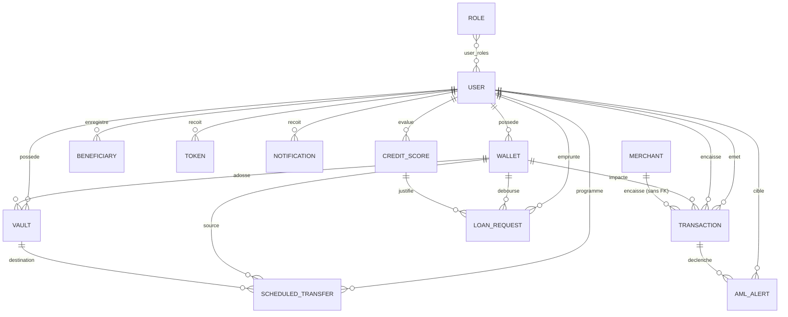

**Deux pièges à ne pas rater en dessinant :**

1. `TRANSACTION` porte **deux** associations vers `USER` — `sender_id` et `receiver_id` — plus une vers `WALLET`. C'est une entité à trois pattes, pas une simple table de mouvement.
2. `MERCHANT` n'a **aucune clé étrangère** : le paiement marchand crédite `merchants.balance` et écrit une ligne `transactions`, mais rien ne les relie en base. La justification est dans `Merchant.java` — un marchand n'a pas de compte utilisateur, et `Wallet.owner` est non-nul par choix de sécurité (invariant IDOR).

### 1.2 Attributs par entité

Toutes les entités héritent de `Listeners` (`@MappedSuperclass`), qui ajoute `created_at` (`timestamp(6)`, NOT NULL, non modifiable) et `last_modified_date` (`timestamp(6)`, nullable). Ces deux colonnes ne sont pas répétées ci-dessous.

#### `_user` — l'entité pivot

| Colonne | Type SQL | Contraintes | Rôle |
|---|---|---|---|
| `id` | bigint identity | **PK** | — |
| `first_name` | varchar(255) | — | Prénom |
| `last_name` | varchar(255) | — | Nom |
| `email` | varchar(255) | UNIQUE | Identifiant de connexion |
| `phone_number` | varchar(255) | NOT NULL, UNIQUE | Clé de résolution d'un transfert interne |
| `country_code` | varchar(2) | — | ISO 3166-1 alpha-2 |
| `avatar` | varchar(255) | — | Référence d'avatar prédéfini, pas de binaire |
| `kyc_level` | varchar → enum | défaut `TIER_0` | Pilote les plafonds journaliers |
| `password` | varchar(255) | — | BCrypt |
| `enabled` | boolean | NOT NULL | `false` jusqu'à confirmation de l'OTP |
| `account_locked` | boolean | NOT NULL | Verrou automatique ou administratif |
| `failed_login_attempts` | integer | NOT NULL, défaut 0 | Verrouillage à 5 |
| `locked_at` | timestamp(6) | nullable | `null` = verrou administratif permanent |
| `last_known_ip` | varchar(255) | — | Détection de nouvel appareil |
| `last_known_user_agent` | varchar(255) | — | Idem |

#### `wallets` — portefeuille (un par devise et par propriétaire)

| Colonne | Type SQL | Contraintes | Rôle |
|---|---|---|---|
| `id` | bigint identity | **PK** | — |
| `currency` | varchar(3) | NOT NULL | XOF seulement (`WalletService.SUPPORTED_CURRENCIES`) |
| `balance` | numeric(19,4) | NOT NULL, défaut 0 | Solde **total** |
| `locked_balance` | numeric(19,4) | NOT NULL, défaut 0 | Part immobilisée **à l'intérieur** de `balance` |
| `active` | boolean | NOT NULL, défaut true | Suspension — jamais de suppression physique |
| `version` | bigint | NOT NULL, défaut 0 | `@Version`, verrouillage optimiste |
| `owner_id` | bigint | NOT NULL, FK → `_user` | — |

> **Attribut dérivé à faire figurer.** Le *solde disponible* n'est pas stocké : `disponible = balance − locked_balance`. C'est cette formule qu'appliquent `TransactionService.checkSufficientFunds`, `LoanService.repay` et `WalletResponse`. Bloquer des fonds dans un coffre incrémente uniquement `locked_balance` ; `balance` ne bouge pas.

#### `vaults` — coffre-fort d'épargne bloquée

| Colonne | Type SQL | Contraintes | Rôle |
|---|---|---|---|
| `id` | bigint identity | **PK** | — |
| `name` | varchar(255) | NOT NULL | Libellé choisi par l'utilisateur |
| `purpose` | varchar(255) | nullable | Motif d'épargne |
| `currency` | varchar(3) | NOT NULL | Héritée du wallet |
| `target_amount` | numeric(19,4) | nullable | Objectif, facultatif |
| `current_amount` | numeric(19,4) | NOT NULL, défaut 0 | Montant immobilisé |
| `unlock_date` | date | nullable | Absente = coffre sans échéance |
| `status` | varchar → enum | NOT NULL, défaut `ACTIVE` | Voir cycle de vie §3.4 |
| `version` | bigint | NOT NULL, défaut 0 | `@Version` |
| `owner_id` | bigint | NOT NULL, FK → `_user` | — |
| `wallet_id` | bigint | NOT NULL, FK → `wallets` | Portefeuille d'adossement |

#### `transactions` — le grand livre

| Colonne | Type SQL | Contraintes | Rôle |
|---|---|---|---|
| `id` | bigint identity | **PK** | — |
| `reference` | varchar(255) | NOT NULL, UNIQUE | Référence fonctionnelle exposée au client |
| `type` | varchar → enum | NOT NULL | 11 valeurs, voir §2.3 |
| `status` | varchar → enum | NOT NULL, défaut `PENDING` | 5 valeurs |
| `amount` | numeric(19,4) | NOT NULL | Montant hors frais |
| `fee` | numeric(19,4) | NOT NULL, défaut 0 | Frais à la charge de l'émetteur |
| `currency` | varchar(3) | NOT NULL | — |
| `receiver_currency` | varchar(3) | nullable | Réservé au multidevise (inutilisé) |
| `exchange_rate` | numeric(19,6) | nullable | Idem |
| `wallet_id` | bigint | nullable, FK → `wallets` | Portefeuille impacté |
| `sender_id` | bigint | nullable, FK → `_user` | Émetteur |
| `receiver_id` | bigint | nullable, FK → `_user` | Non nul **seulement** si le destinataire est client Kola |
| `receiver_phone_number` | varchar(255) | nullable | Destinataire externe (mobile money) |
| `receiver_country_code` | varchar(2) | nullable | Alimente la règle LAB-FT « pays à risque » |
| `description` | varchar(255) | nullable | Libellé |
| `external_reference` | varchar(255) | nullable | Référence opérateur mobile money |
| `idempotency_key` | varchar(255) | UNIQUE | Anti-rejeu ; le conflit remonte en HTTP 409 |

#### `credit_scores`

| Colonne | Type SQL | Contraintes | Rôle |
|---|---|---|---|
| `id` | bigint identity | **PK** | — |
| `score` | integer | NOT NULL | 0 à 100 |
| `tier` | varchar → enum | NOT NULL | Dérivé du score |
| `breakdown_json` | TEXT | nullable | Détail explicable des 8 règles |
| `max_loan_amount` | numeric(15,2) | NOT NULL | Figé depuis le tier |
| `monthly_rate` | numeric(5,4) | NOT NULL | Taux mensuel, ex. `0.0150` |
| `expires_at` | timestamp(6) | NOT NULL | +30 jours ; recalcul paresseux au-delà |
| `latest` | boolean | NOT NULL | Un seul `true` par utilisateur |
| `user_id` | bigint | NOT NULL, FK → `_user` | — |

#### `loan_requests`

| Colonne | Type SQL | Contraintes | Rôle |
|---|---|---|---|
| `id` | bigint identity | **PK** | — |
| `requested_amount` | numeric(15,2) | NOT NULL | Principal |
| `duration_months` | integer | NOT NULL | 1 à 12 |
| `monthly_rate` | numeric(5,4) | NOT NULL | Copié du score |
| `total_repayment` | numeric(15,2) | NOT NULL | `principal × (1 + taux × durée)` |
| `status` | varchar → enum | NOT NULL | Voir §3.6 |
| `purpose` | varchar(255) | nullable | Motif de la demande |
| `due_date` | date | nullable | Échéance unique, prêt *bullet* |
| `rejection_reason` | varchar(255) | nullable | Motif du refus |
| `defaulted_at` | timestamp(6) | nullable | Trace conservée même après régularisation |
| `borrower_id` | bigint | NOT NULL, FK → `_user` | Emprunteur |
| `wallet_id` | bigint | NOT NULL, FK → `wallets` | Portefeuille de déboursement |
| `credit_score_id` | bigint | NOT NULL, FK → `credit_scores` | Instantané du score au moment de la demande |

#### Entités périphériques

| Table | Colonnes propres | Clés et contraintes |
|---|---|---|
| `role` | `id` (integer), `role_name` | PK `id` · UNIQUE `role_name` · valeurs semées : `ADMIN`, `CLIENT` |
| `user_roles` | `user_id`, `role_id` | PK composite `(user_id, role_id)` posée en V2 · double FK |
| `beneficiaries` | `alias`, `phone_number`, `country_code`(2), `network` | FK `owner_id` · UNIQUE `(owner_id, phone_number, network)` |
| `merchants` | `name`, `category`, `merchant_code`, `balance` numeric(19,4), `currency`(3) | UNIQUE `merchant_code` · **aucune FK** |
| `notifications` | `title`, `body` varchar(500), `type`, `read` boolean | FK `user_id` NOT NULL |
| `aml_alerts` | `risk_score` int, `risk_level`, `status`, `triggered_rules_json` TEXT, `review_notes` varchar(1000), `reviewed_by` | FK `user_id` NOT NULL · FK `transaction_id` *nullable* |
| `scheduled_transfers` | `frequency`, `execution_day` int, `amount` numeric(19,4), `currency`(3), `description`, `status`, `last_executed_at`, `next_execution_date` | FK `user_id`, `wallet_id` NOT NULL · FK `target_vault_id` *nullable* |
| `token` | `token` varchar(6), `token_type`, `expires_at`, `validated_at` | FK `user_id` NOT NULL · pas d'unicité sur la valeur (un OTP à 6 chiffres se répète) |

### 1.3 Cardinalités et intégrité

Les 19 associations, en notation Merise `(min, max)` :

| Entité source | Association | Entité cible | Côté source | Côté cible | Colonne porteuse |
|---|---|---|---|---|---|
| User | détient | Role | (1, n) | (0, n) | `user_roles` (jointure) |
| User | possède | Wallet | (0, n) | (1, 1) | `wallets.owner_id` |
| User | possède | Vault | (0, n) | (1, 1) | `vaults.owner_id` |
| Wallet | adosse | Vault | (0, n) | (1, 1) | `vaults.wallet_id` |
| User | enregistre | Beneficiary | (0, n) | (1, 1) | `beneficiaries.owner_id` |
| User | émet | Transaction | (0, n) | (0, 1) | `transactions.sender_id` |
| User | encaisse | Transaction | (0, n) | (0, 1) | `transactions.receiver_id` |
| Wallet | est impacté par | Transaction | (0, n) | (0, 1) | `transactions.wallet_id` |
| User | est évalué par | CreditScore | (0, n) | (1, 1) | `credit_scores.user_id` |
| User | emprunte | LoanRequest | (0, n) | (1, 1) | `loan_requests.borrower_id` |
| Wallet | reçoit le déboursement | LoanRequest | (0, n) | (1, 1) | `loan_requests.wallet_id` |
| CreditScore | justifie | LoanRequest | (0, n) | (1, 1) | `loan_requests.credit_score_id` |
| User | est ciblé par | AmlAlert | (0, n) | (1, 1) | `aml_alerts.user_id` |
| Transaction | déclenche | AmlAlert | (0, n) | (0, 1) | `aml_alerts.transaction_id` |
| User | reçoit | Notification | (0, n) | (1, 1) | `notifications.user_id` |
| User | programme | ScheduledTransfer | (0, n) | (1, 1) | `scheduled_transfers.user_id` |
| Wallet | alimente | ScheduledTransfer | (0, n) | (1, 1) | `scheduled_transfers.wallet_id` |
| Vault | est destinataire de | ScheduledTransfer | (0, n) | (0, 1) | `scheduled_transfers.target_vault_id` |
| User | reçoit | Token | (0, n) | (1, 1) | `token.user_id` |

#### Contraintes d'unicité — chacune porte une règle métier

| Contrainte | Table | Colonnes | Règle qu'elle impose |
|---|---|---|---|
| `uk_wallet_owner_currency` | wallets | owner_id, currency | Un seul portefeuille par devise et par client |
| `uk_benef_owner_phone_network` | beneficiaries | owner_id, phone_number, network | Pas de bénéficiaire en double |
| `pk_user_roles` | user_roles | user_id, role_id | Un rôle attribué une seule fois |
| unicité colonne | transactions | idempotency_key | Un mouvement d'argent jamais rejoué |
| unicité colonne | transactions | reference | Référence fonctionnelle unique |
| unicité colonne | `_user` | email · phone_number | Identité unique |
| unicité colonne | merchants | merchant_code | Code QR unique |

#### Index (V1 + V2)

| Table | Index | Requête servie |
|---|---|---|
| transactions | `(status, created_at)` · `(type, currency)` · `(wallet_id, created_at)` · `(sender_id, created_at)` · `(receiver_id, created_at)` | Dashboard admin, historique, plafonds KYC, scoring, LAB-FT |
| aml_alerts | `(status, created_at)` · `(risk_level)` · `(user_id)` · `(transaction_id)` | Console conformité |
| credit_scores | `(user_id, latest)` | Lecture du score courant |
| loan_requests | `(borrower_id, status)` · `(status, due_date)` | Contrôle « prêt actif » · batch de mise en défaut |
| vaults | `(owner_id, status)` · `(wallet_id)` | Liste des coffres |
| scheduled_transfers | `(status, next_execution_date)` · `(user_id)` | Balayage du job quotidien |
| notifications | `(user_id, created_at)` · `(user_id, read)` | Fil et compteur de non-lus |
| token | `(token, token_type)` · `(user_id)` | Validation d'un OTP |
| `_user` | `(created_at)` | Statistiques d'inscription |

---

## 2 · Modèle objet

Organisation en *package par fonctionnalité* sous `com.kola.backend` : chaque package porte son entité, son repository, son service, son contrôleur et ses DTO. Il n'y a pas de couche `dto/` ou `repository/` transversale.

### 2.1 Entités et héritage

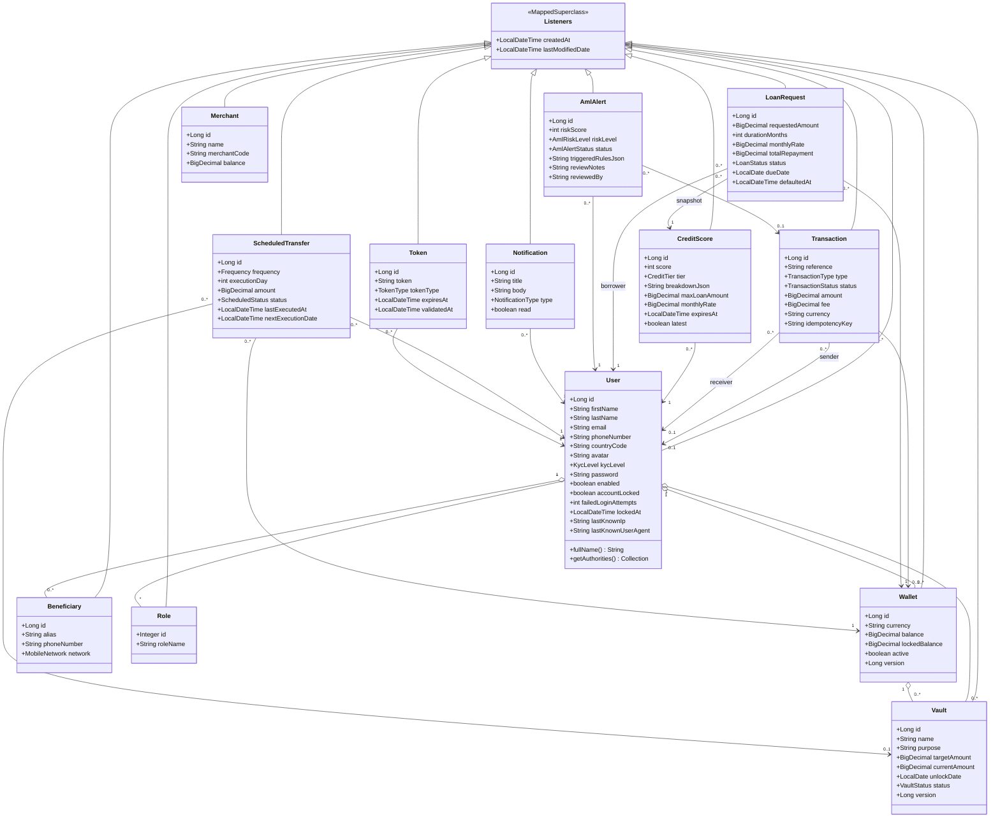

Toutes les `@ManyToOne` sont en `FetchType.LAZY`. Seule exception : `User.roles` est `EAGER`, car `JwtAuthFilter` lit les autorités au niveau Servlet Filter, avant l'ouverture de la session Hibernate.

**Deux particularités à mentionner :**

1. `User` implémente `UserDetails` (Spring Security) et `java.security.Principal` : l'entité JPA est aussi l'objet d'authentification. `getUsername()` renvoie l'email.
2. Les collections `User.wallets / vaults / beneficiaries` sont déclarées **sans `cascade` ni `orphanRemoval`**. C'est délibéré : en fintech on désactive, on ne supprime jamais. Il faut donc une **agrégation** (losange creux), pas une composition.

### 2.2 Couches et dépendances entre services

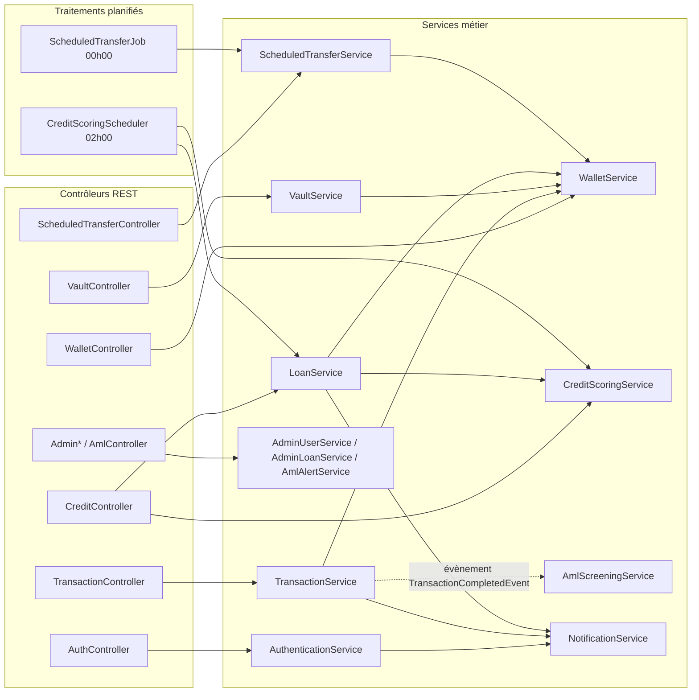

Le lien `TransactionService → AmlScreeningService` est **asynchrone** : évènement Spring publié dans la transaction, consommé en `AFTER_COMMIT` dans une transaction neuve. La surveillance ne peut donc jamais annuler un paiement déjà validé.

### 2.3 Énumérations

| Énumération | Valeurs | Portée |
|---|---|---|
| `KycLevel` | TIER_0 · TIER_1 · TIER_2 · TIER_3 | Téléphone / email vérifié / pièce soumise / identité validée |
| `VaultStatus` | ACTIVE · UNLOCKED · CLOSED | Cycle de vie du coffre |
| `TransactionType` | DEPOSIT · WITHDRAWAL · TRANSFER_OUT · TRANSFER_IN · VAULT_LOCK · VAULT_UNLOCK · FEE · SCHEDULED_TRANSFER · LOAN_DISBURSEMENT · LOAN_REPAYMENT · MERCHANT_PAYMENT | 11 natures d'écriture au grand livre |
| `TransactionStatus` | PENDING · SUCCESS · FAILED · CANCELLED · REFUNDED | Cycle de vie de l'écriture |
| `LoanStatus` | PENDING · APPROVED · REJECTED · DISBURSED · REPAID · DEFAULTED | Cycle de vie du prêt |
| `CreditTier` | INELIGIBLE · BASIC · STANDARD · PREMIUM · ELITE | Enum **porteuse de données** : bornes, plafond, taux, libellé |
| `ScoringRule` | 8 règles pondérées (§4.3) | Enum porteuse : libellé, explication, points max |
| `AmlRule` | 9 typologies (§4.4) | Enum porteuse : libellé, explication, poids de risque |
| `AmlRiskLevel` | LOW · MEDIUM · HIGH · CRITICAL | Enum porteuse : bornes de score |
| `AmlAlertStatus` | OPEN · REVIEWING · CLEARED · CONFIRMED | Cycle de vie de l'alerte conformité |
| `NotificationType` | TRANSACTION · SECURITY · SYSTEM | Classement du fil de notifications |
| `TokenType` | ACTIVATION · PASSWORD_RESET | Nature de l'OTP |
| `MobileNetwork` | MIXX_BY_YAS · MOOV_TOGO · WAVE · ORANGE_MONEY · FREE_MONEY · MTN_MOMO · VODAFONE_CASH · AIRTELTIGO · OPAY · PALMPAY · WESTERN_UNION · MONEYGRAM | 12 réseaux mobile money |
| `ScheduledTransfer.Frequency` | MONTHLY · WEEKLY | Enum interne à l'entité |
| `ScheduledTransfer.ScheduledStatus` | ACTIVE · PAUSED · FAILED_PERMANENTLY | Enum interne à l'entité |

Trois énumérations techniques complètent l'ensemble sans être persistées : `EmailTemplateName` (4 gabarits Thymeleaf), `RateLimitPolicy` (6 politiques Bucket4j) et `AdminMetric` (indicateurs du tableau de bord).

---

## 3 · Cycles de vie

Neuf objets ont un cycle de vie exploitable en diagramme d'états-transitions. Pour chacun : le diagramme, puis la table des transitions avec la méthode Java qui la provoque — c'est cette colonne qui rend le diagramme vérifiable.

### 3.1 Compte utilisateur

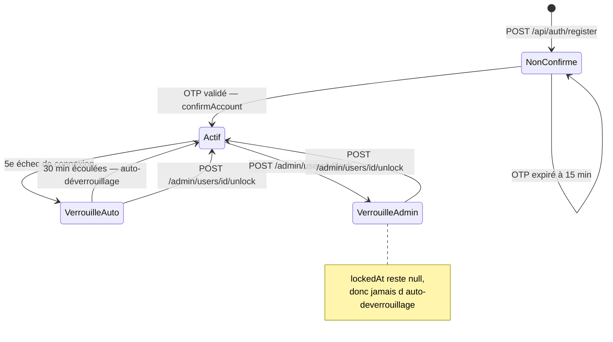

Deux booléens portent l'état : `enabled` (confirmation) et `accountLocked` (verrou). `lockedAt` distingue le verrou automatique du verrou administratif.

| État départ | Évènement | Garde | État arrivée | Méthode |
|---|---|---|---|---|
| — | Inscription | Rôle CLIENT existant | enabled=false, locked=false | `AuthenticationService.register` |
| Non confirmé | Saisie de l'OTP | Token valide et non expiré | enabled=true | `confirmAccount` |
| Actif | Mot de passe erroné | `failedLoginAttempts + 1 ≥ 5` | accountLocked=true, lockedAt=now | `registerFailedAttempt` |
| Verrouillé auto | Tentative de connexion | `lockedAt + 30 min < now` | accountLocked=false, compteur=0 | `checkAndAutoUnlockIfExpired` |
| Actif | Connexion réussie | — | compteur=0, IP et user-agent mis à jour | `authenticate` |
| Actif | Verrouillage admin | Pas d'auto-verrouillage | accountLocked=true, **lockedAt=null** | `AdminUserService.lock` |
| Verrouillé | Déverrouillage admin | — | accountLocked=false, compteur=0 | `AdminUserService.unlock` |

### 3.2 Niveau KYC

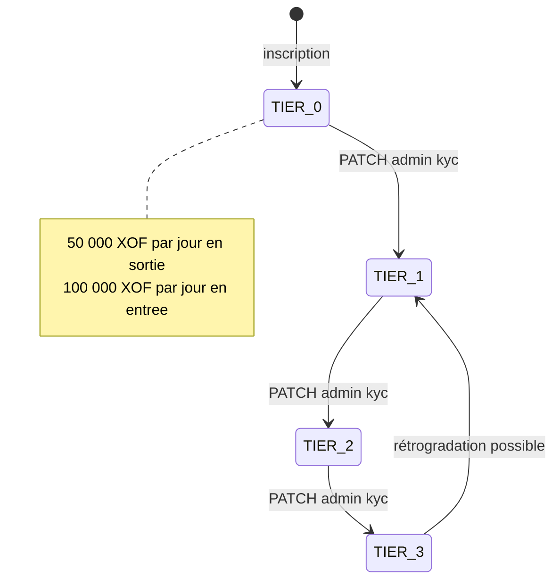

Aucune progression automatique : seul `PATCH /api/admin/users/{id}/kyc` change le niveau, avec un motif obligatoire de 10 à 500 caractères. La transition peut aller dans les deux sens ; la seule garde est « niveau différent de l'actuel ».

### 3.3 Jeton OTP

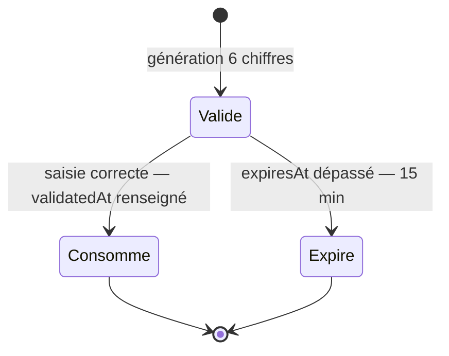

L'état n'est pas une colonne : il se déduit de `validatedAt` (null = non consommé) et de `expiresAt`. Un jeton consommé n'est jamais supprimé.

### 3.4 Coffre-fort

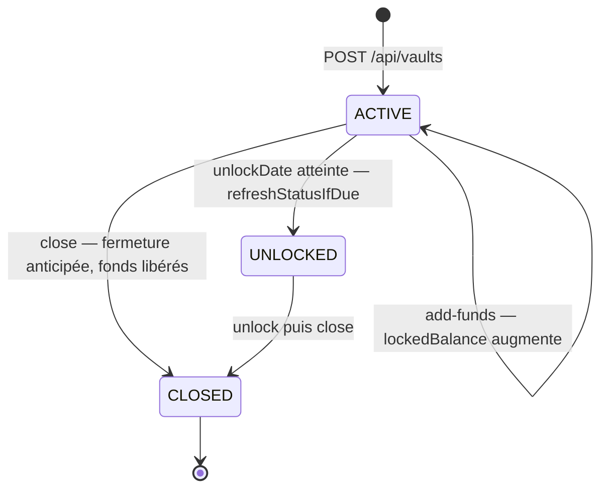

Le passage à `UNLOCKED` est **paresseux** : aucun batch ne le déclenche, il est évalué à chaque lecture du coffre par `refreshStatusIfDue`.

| Départ | Évènement | Garde | Arrivée | Effet sur le portefeuille |
|---|---|---|---|---|
| — | `createVault` | disponible ≥ montant initial | ACTIVE | `lockedBalance += montant` |
| ACTIVE | `addFunds` | statut ACTIVE et fonds suffisants | ACTIVE | `lockedBalance += montant` |
| ACTIVE | lecture après échéance | `unlockDate ≤ aujourd'hui` | UNLOCKED | aucun |
| UNLOCKED | `unlock` | statut ≠ ACTIVE et ≠ CLOSED | UNLOCKED | `lockedBalance −= currentAmount`, coffre remis à 0 |
| ACTIVE | `closeEarly` | statut ≠ CLOSED | CLOSED | fonds libérés puis coffre fermé |
| UNLOCKED | `closeEarly` | — | CLOSED | aucun — fonds déjà libérés |

### 3.5 Transaction

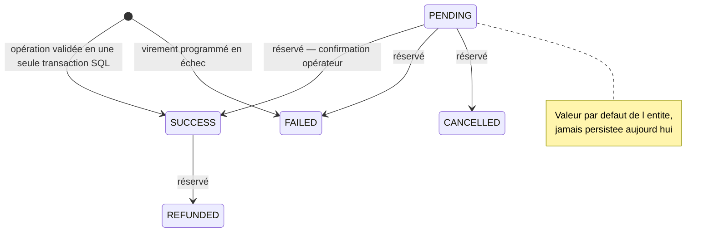

Le cycle réel est plat : faute d'intégration opérateur mobile money, chaque écriture naît directement en `SUCCESS` (ou `FAILED` pour un virement programmé qui échoue). Les trois autres états sont dans l'énumération mais jamais atteints — à représenter en pointillés.

| Type | Créé par | Statut initial | Effet monétaire |
|---|---|---|---|
| DEPOSIT | `TransactionService.deposit` | SUCCESS | `balance +=` montant |
| WITHDRAWAL | `withdraw` | SUCCESS | `balance −=` montant + frais 1 % |
| TRANSFER_OUT | `transfer` | SUCCESS | `balance −=` montant + frais 1,5 % |
| TRANSFER_IN | `transfer`, si destinataire client Kola | SUCCESS | `balance +=` montant net |
| FEE | `transfer`, si frais > 0 | SUCCESS | aucun — trace du prélèvement déjà opéré |
| MERCHANT_PAYMENT | `payMerchant` | SUCCESS | `balance −=` montant, `merchant.balance +=` |
| VAULT_LOCK | `VaultService.createVault / addFunds` | SUCCESS | `lockedBalance +=` montant |
| VAULT_UNLOCK | `releaseFundsToWallet` | SUCCESS | `lockedBalance −=` montant |
| LOAN_DISBURSEMENT | `LoanService.disburseLoan` | SUCCESS | `balance +=` principal |
| LOAN_REPAYMENT | `LoanService.repay` | SUCCESS | `balance −=` remboursement total |
| SCHEDULED_TRANSFER | `ScheduledTransferService` | SUCCESS ou FAILED | vers coffre : `lockedBalance +=` · sinon `balance −=` |

### 3.6 Demande de prêt

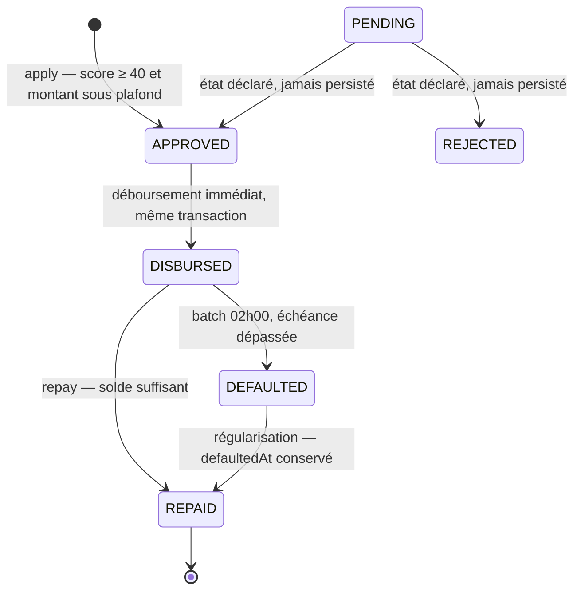

Un refus n'est pas un statut : c'est une exception (`InsufficientCreditScoreException`, `ActiveLoanExistsException`) et aucune ligne n'est créée. `PENDING` et `REJECTED` restent donc théoriques.

| Départ | Évènement | Gardes | Arrivée | Effets de bord |
|---|---|---|---|---|
| — | `POST /api/credit/loans` | aucun prêt actif · aucun prêt en défaut · score ≥ 40 · montant ≤ plafond du tier | APPROVED | Instantané du score attaché |
| APPROVED | Interne, sans appel externe | — | DISBURSED | Portefeuille crédité + écriture LOAN_DISBURSEMENT + notification |
| DISBURSED | `POST /loans/{id}/repay` | disponible ≥ `totalRepayment` | REPAID | Débit, écriture LOAN_REPAYMENT, **recalcul du score**, notification |
| DISBURSED | Batch quotidien 02h00 | `dueDate` dépassée | DEFAULTED | `defaultedAt = now`, notification SYSTEM |
| DEFAULTED | `repay` | disponible suffisant | REPAID | Idem ; `defaultedAt` **n'est pas effacé** et continue de pénaliser le score |

### 3.7 Score de crédit

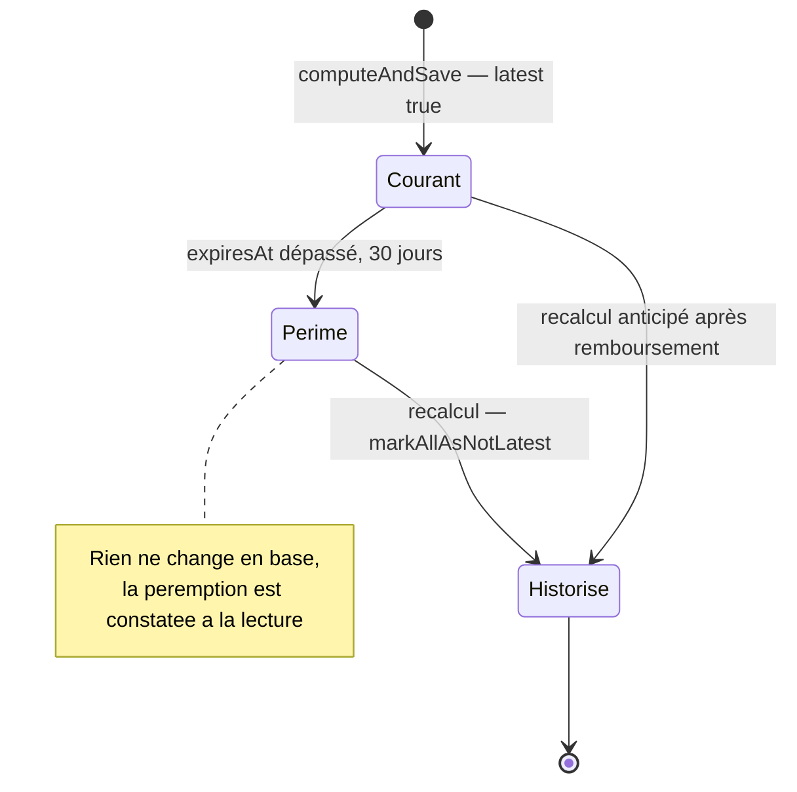

Le score est immuable : on ne le met jamais à jour, on insère une nouvelle ligne et on bascule l'ancienne à `latest = false`. Trois déclencheurs de recalcul : lecture d'un score périmé (`getOrCompute`), remboursement d'un prêt, batch de 02 h 00.

### 3.8 Alerte LAB-FT

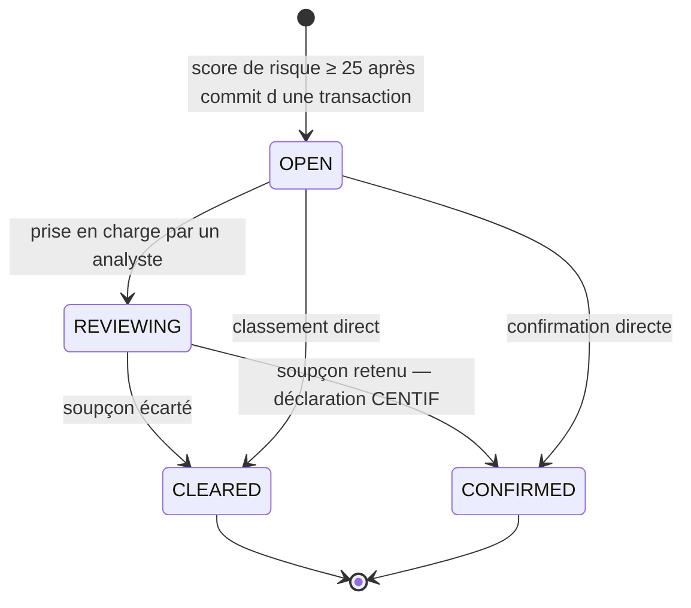

Aucune garde de transition n'est codée : `POST /api/admin/aml/alerts/{id}/review` accepte n'importe quel statut cible et enregistre l'email de l'analyste dans `reviewedBy`. Le résultat n'est jamais exposé au client — le prévenir constituerait un délit de divulgation (*tipping off*).

### 3.9 Virement programmé et notification

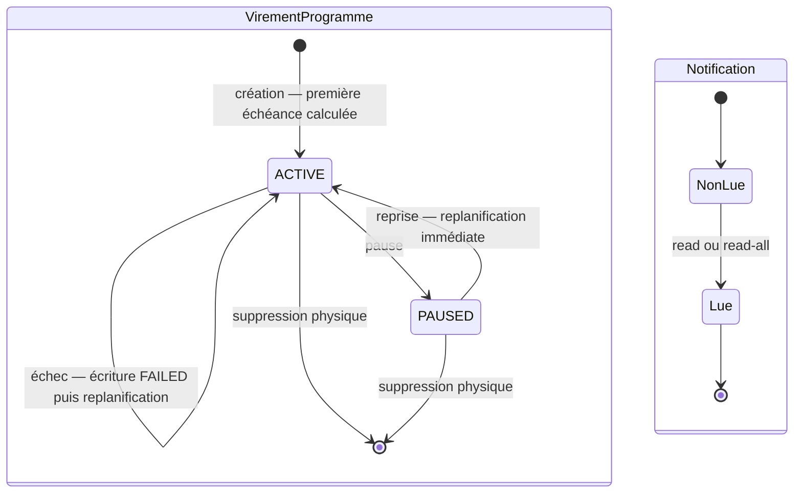

Le virement programmé est la seule entité du domaine qui accepte une **suppression physique** (`DELETE /api/scheduled-transfers/{id}`). L'état `FAILED_PERMANENTLY` existe dans l'énumération mais n'est jamais affecté : un échec est tracé puis replanifié à l'échéance suivante.

### 3.10 Portefeuille

Deux états seulement, portés par le booléen `active` : **actif** (à la création) et **suspendu**. Aucun code ne repasse aujourd'hui un portefeuille à `false` — la suspension est lue (`findOwnedWalletForUpdateOrThrow`, `findOrCreateReceivingWallet` lèvent `WalletInactiveException`) mais jamais écrite. À représenter comme une transition administrative prévue, non implémentée.

---

## 4 · Règles métier chiffrées

Ces valeurs annotent utilement les diagrammes (gardes de transition, contraintes d'intégrité).

### 4.1 Plafonds KYC — `TransactionPolicy`

| Niveau | Sortie / jour (XOF) | Entrée / jour (XOF) |
|---|---:|---:|
| TIER_0 | 50 000 | 100 000 |
| TIER_1 | 200 000 | 500 000 |
| TIER_2 | 1 000 000 | 2 000 000 |
| TIER_3 | 999 999 999 | 10 000 000 |

Sortie = TRANSFER_OUT + WITHDRAWAL + MERCHANT_PAYMENT du jour. Entrée = DEPOSIT du jour.

### 4.2 Frais et éligibilité au crédit

| Barème | Valeur | Détail |
|---|---:|---|
| Frais de transfert | 1,5 % | À la charge de l'émetteur, écriture FEE séparée |
| Frais de retrait | 1,0 % | Déduit du même débit |
| Dépôt et paiement marchand | 0 % | Gratuits |
| Score minimum d'emprunt | 40 / 100 | Borne basse du palier BASIC |
| Validité d'un score | 30 jours | Recalcul paresseux à la lecture |

`CreditTier` — plafond et taux dérivés du score :

| Palier | Score | Plafond (XOF) | Taux mensuel |
|---|---:|---:|---:|
| INELIGIBLE | 0 – 39 | 0 | — |
| BASIC | 40 – 59 | 25 000 | 3,0 % |
| STANDARD | 60 – 74 | 100 000 | 2,0 % |
| PREMIUM | 75 – 89 | 500 000 | 1,5 % |
| ELITE | 90 – 100 | 2 000 000 | 1,0 % |

### 4.3 Les 8 règles de scoring — total 100 points

| Règle | Points | Ce qu'elle mesure |
|---|---:|---|
| KYC_LEVEL | 15 | Niveau de vérification d'identité |
| DEPOSIT_REGULARITY | 15 | Régularité des dépôts sur 30 jours |
| LOAN_REPAYMENT_HISTORY | 15 | Prêts remboursés — et défauts passés |
| VAULT_DISCIPLINE | 15 | Coffres tenus jusqu'à l'échéance |
| EXPENSE_INCOME_RATIO | 15 | Ratio dépenses / revenus |
| ACCOUNT_SENIORITY | 10 | Ancienneté du compte |
| TRANSACTION_VOLUME | 10 | Volume mensuel |
| BENEFICIARY_DIVERSITY | 10 | Diversité du réseau de bénéficiaires |

### 4.4 Les 9 règles LAB-FT

| Typologie | Poids | Déclenchement |
|---|---:|---|
| STRUCTURING | 30 | ≥ 3 opérations entre 700 000 et 1 000 000 XOF sur 7 jours, cumul ≥ seuil |
| RAPID_PASSTHROUGH | 25 | Sortie ≤ 60 min après un dépôt d'au moins 80 % du montant |
| HIGH_RISK_COUNTRY | 25 | Pays destinataire dans {KP, IR, MM} |
| AMOUNT_ANOMALY | 20 | Montant > moyenne + 3 σ, à partir de 5 opérations d'historique |
| VELOCITY_SPIKE | 20 | ≥ 5 opérations sur 24 h et > 3 × la moyenne quotidienne |
| DORMANT_REACTIVATION | 20 | ≥ 90 jours d'inactivité puis opération ≥ 100 000 XOF |
| NEW_BENEFICIARY_BURST | 15 | ≥ 3 destinataires inédits en 24 h |
| THRESHOLD_BREACH | 15 | Opération unitaire ≥ 1 000 000 XOF |
| UNUSUAL_HOUR | 10 | Opération entre 0 h et 5 h, < 10 % de l'historique, min. 10 opérations |

Score cumulé plafonné à 100. Alerte créée à partir de **25**. Niveaux : LOW 0-24 · MEDIUM 25-49 · HIGH 50-74 · CRITICAL 75-100.

### 4.5 Limitation de débit — `RateLimitPolicy` (Bucket4j + Redis)

| Politique | Quota | Fenêtre | Clé |
|---|---:|---|---|
| LOGIN | 5 | 15 minutes | IP + email |
| REGISTER | 3 | 1 heure | IP |
| FORGOT_PASSWORD | 3 | 1 heure | email |
| RESET_PASSWORD | 5 | 1 heure | IP |
| CONFIRM_ACCOUNT | 10 | 1 heure | IP |
| REFRESH_TOKEN | 20 | 1 heure | IP |

---

## 5 · Écarts entre le modèle déclaré et le code

À trancher avant de dessiner : soit ces états sont représentés (en pointillés, comme prévus), soit ils sont omis et le diagramme colle au comportement réel. Les deux sont défendables, mais il faut le dire explicitement.

| Élément | Déclaré | Réalité du code |
|---|---|---|
| `TransactionStatus` | PENDING, CANCELLED, REFUNDED | Jamais persistés — pas d'intégration opérateur, chaque écriture naît SUCCESS ou FAILED |
| `LoanStatus` | PENDING, REJECTED | Jamais persistés — l'approbation est automatique, le refus est une exception sans ligne créée |
| `ScheduledStatus` | FAILED_PERMANENTLY | Jamais affecté — un échec est tracé puis replanifié |
| `Wallet.active` | Portefeuille suspendable | Lu partout, jamais écrit à `false` : aucune API de suspension |
| `Transaction.receiverCurrency` / `exchangeRate` | Multidevise | Colonnes réservées ; `WalletService` n'accepte que XOF, aucun service de change |
| Traçabilité admin | Actions KYC et verrouillage | Journalisées en SLF4J WARN uniquement — **pas de table d'audit** (prochaine migration Flyway à prévoir) |
| `Merchant` | Encaisse des paiements | Aucune FK vers `transactions` : le lien est fonctionnel, pas relationnel |

---

## 6 · Surface API et traitements planifiés

Pour un diagramme de cas d'utilisation ou de séquence, voici les points d'entrée réels.

| Base | Opérations | Accès |
|---|---|---|
| `/api/auth` | register · confirm · login · forgot-password · reset-password · refresh-token · logout | Public, sous limitation de débit |
| `/api/users` | GET me · PUT me · PUT me/avatar · POST me/password | Authentifié |
| `/api/wallets` | GET liste · GET {id} · POST création | Authentifié |
| `/api/transactions` | deposit · withdraw · transfer · pay-merchant · GET wallet/{id} · GET {reference} | Authentifié |
| `/api/vaults` | GET liste · GET {id} · POST création · add-funds · unlock · close | Authentifié |
| `/api/beneficiaries` | GET liste · GET {id} · POST · DELETE | Authentifié |
| `/api/credit` | GET score · POST score/refresh · GET score/history · POST loans · GET loans · GET loans/{id} · POST loans/{id}/repay | Authentifié |
| `/api/scheduled-transfers` | GET · POST · pause · resume · DELETE | Authentifié |
| `/api/notifications` | GET · unread-count · {id}/read · read-all | Authentifié |
| `/api/merchants` | GET {code} | Authentifié |
| `/api/admin` | overview · users (liste, détail, kyc, lock, unlock) · loans (liste, détail, overview) · aml (alerts, overview, review) | Autorité ADMIN |

| Job | Cron | Action |
|---|---|---|
| `ScheduledTransferJob` | `0 0 0 * * *` — minuit | Exécute les virements dus, une transaction par virement |
| `CreditScoringScheduler` | `0 0 2 * * *` — 02 h 00 | Recalcule tous les scores puis marque les prêts échus en DEFAULTED |
